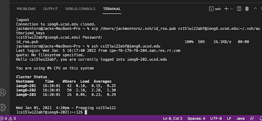

# Lab1 Report
The objective here is to:
* Get familiar with VSCode and ssh
* Demonstrate remote running


To this end we will:
1. Introduce ourselves to the group
2. Post a screenshot of our VSCode homepage to demonstrate that it is working
3. Access ieng6 remotely through ssh and post a screenshot
4. Run some terminal commands
5. Move files to the UCSD server using scp
6. Evade passwords by making ssh keys
7. Demonstrate more efficient methods of remote running

# Setup (Pt. 1)
Before we get started, you will need to change your password for the student account related to this course in order to make to best use of your time. The system will take around 5-15 minutes to update your password, so it is good to do this as soon as possible. You can access your account by following the link below.

[course-specific account](https://sdacs.ucsd.edu/~icc/index.php)

Once you update your password for this course, you can log onto UCSD's remote servers to access its files. We do this through a terminal command called ssh, but we will get to that later.

You must first install Visual Studio code to your computer:

[vscode setup](https://code.visualstudio.com/)

There will be instructions on installation once you get to the VSCode download webpage.
 
Once installed the environment will look something like this, but you will probably see a welcome message:


# Remotely Connecting (Pt. 2)

When you have VSCode up and running, you can log into the ieng6 remote server using the following ssh command:
```
$ ssh cs15lwi22zz@ieng6.ucsd.edu
```

The terminal will ask you for your password that you set up on your course account, so type that in and press enter. As stated previously, your password info could take up to 15 minutes to update from the time you changed it.

Once you enter your password, your output should look like this:


# Trying Some Commands (Pt. 3)

Now, you can run some commands! Here are a few you can try:

* `cd`  This one allows you to move between directories so you can access files.
* `ls`  This will provide you with a list of the files within the directory you are currently in
* `ls -lat`
* `ls -a`
* `cp /home/linux/ieng6/cs15lwi22/public/hello.txt ~/`
* `cat /home/linux/ieng6/cs15lwi22/public/hello.txt`


Once you are done experimenting with commands, you will need to log out of the remote server.
To do this you can use the Ctrl+D hotkey or run the following command:

```
exit
```

# Moving Files with scp (Pt. 4)

In the top-left corner of your screen click File->New File to create a new file which you will name `WhereAmI.java`. Once creater, you will post the following code:
 
```
 class WhereAmI {
  public static void main(String[] args) {
    System.out.println(System.getProperty("os.name"));
    System.out.println(System.getProperty("user.name"));
    System.out.println(System.getProperty("user.home"));
    System.out.println(System.getProperty("user.dir"));
  }
 }
 ```
 From the directory where you made this file, you will type the following command from the terminal:
 ```
 scp WhereAmI.java cs15lwi22zz@ieng6.ucsd.edu:~/
 ```
 
 Log into ieng6 again through ssh and enter ls in the terminal. You will see that the file has indeed been sent to the remote server.
 
 
 
 # Setting an ssh Key (Pt. 5)

 Now that you have tried out scp, we have a solution for you so that you no longer need to type in your password every time you need to access the remote server ieng6. This is called `ssh-keygen`.
 
 You will run this code in your terminal to set it up:
 
```
$ ssh-keygen
Generating public/private rsa key pair.
Enter file in which to save the key (/Users/joe/.ssh/id_rsa): /Users/joe/.ssh/id_rsa
Enter passphrase (empty for no passphrase): 
Enter same passphrase again: 
Your identification has been saved in /Users/joe/.ssh/id_rsa.
Your public key has been saved in /Users/joe/.ssh/id_rsa.pub.
The key fingerprint is:
SHA256:jZaZH6fI8E2I1D35hnvGeBePQ4ELOf2Ge+G0XknoXp0 joe@Joes-Mac-mini.local
The key's randomart image is:
+---[RSA 3072]----+
|                 |
|       . . + .   |
|      . . B o .  |
|     . . B * +.. |
|      o S = *.B. |
|       = = O.*.*+|
|        + * *.BE+|
|           +.+.o |
|             ..  |
+----[SHA256]-----+
```

Now you will copy the public key created by the code above to the .ssh server via the following code:
```
$ ssh cs15lwi22zz@ieng6.ucsd.edu
<Enter Password>
# now on server
$ mkdir .ssh
$ <logout>
# back on client
$ scp /Users/joe/.ssh/id_rsa.pub cs15lwi22@ieng6.ucsd.edu:~/.ssh/authorized_keys
# You use your username and the path you saw in the command above
```

When you have completed this, your output should look something like this:


# Optimizing Remote Running (Pt. 6)

You can make remote running even easier now by typing commands on the same line as your ssh command like this:
```
$ ssh cs15lwi22@ieng6.ucsd.edu "ls"
```

You can also run multiple commands on each line by adding a semicolon. If these commands share a line with ssh, make sure they are within quotation marks:
```
$ cp WhereAmI.java OtherMain.java; javac OtherMain.java; java WhereAmI
```
When you run the command lines above, you should produce the following output:


