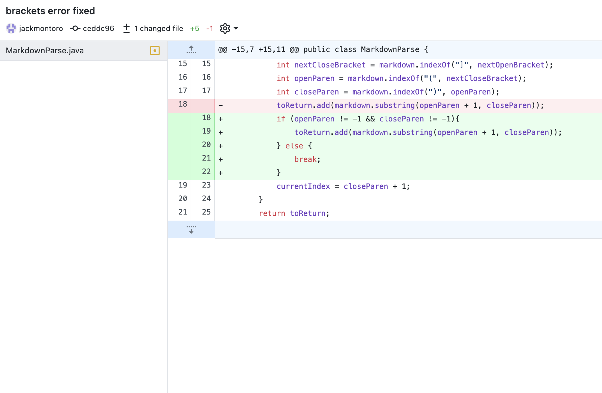
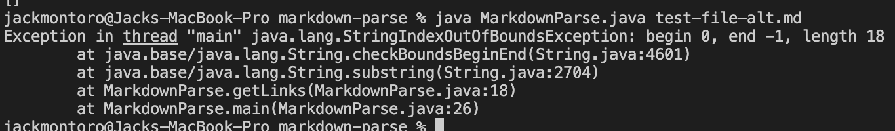
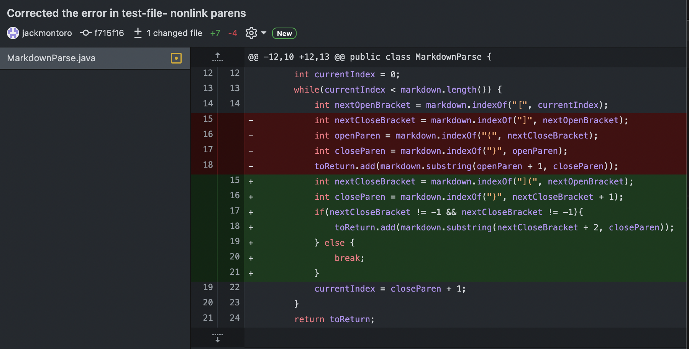

## Lab Report 2
# Code Change 1
The first test-file I found that could break the code was a test-file with brackets, but no parens. This input type causes the toReturn ArrayList to add a substring with an erroneous index values.

I edited the code from the original Markdown file to resolve this issue:

The error orginated from this test-file:
[test-file1](https://github.com/ucsd-cse15l-w22/markdown-parse/commit/4b3a6476af9b8452b029b248b3e9bf4f836b5325)

The above code change resolved the following error message:

When the issue was resolved, the program output the following given the above test-file:
`[]`
# Code Change 2
The next change I made to the markdown file addresses the potential issue of non-url strings after brackets and in parentheses being printed by the file. This output is triggered by placing text inside parentheses after brackets that is not formatted correctly as a link `[sometext] (sometext)` instead of `[link](link)`.

This code was changed from the original Markdown file to remedy a bug when the following test-file was run:

[testfile2](https://github.com/jackmontoro/markdown-parse/commit/1ed204abaa4bb2bdf70c28d9edb75dfdb0023b65#diff-d902b3a6dba925548b7ea18ffb80dd0c28f1bc45f1d738a5da414273711a4409)

The program outputs `[cause an error, https://something.com, some-page.html]`.

After I fixed the code, the ouput was `[https://something.com, some-page.html]`.
# Code Change 3
The last change I made to the markdown file addresses the symptom of an image being confused for a link by MarkdownParse.java. To address this bug in the code, we will have to set restrictions so the program does not interpret `

The program will erroneously output `[page.com]`

After I fixed the code the output was `[]`
