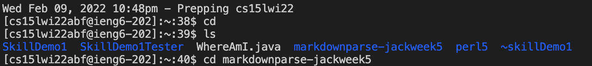
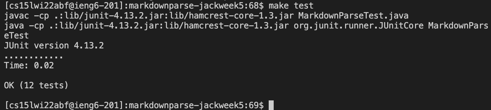
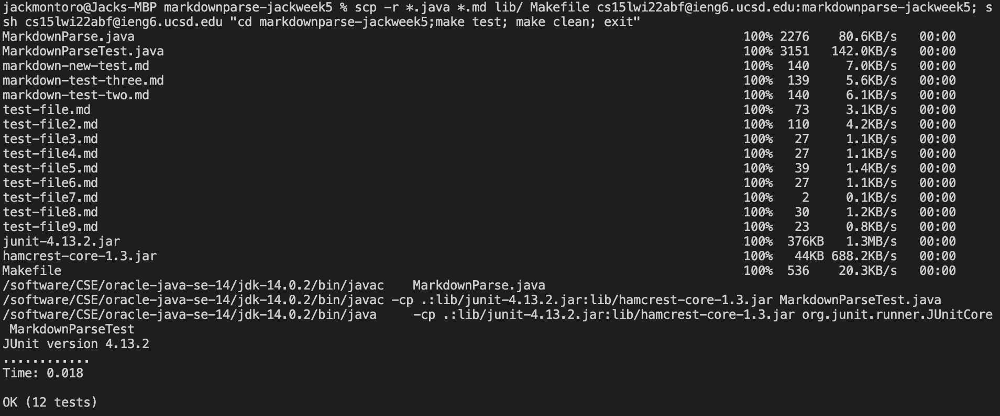

# Lab Report 3

# Copying your whole markdown-parse directory to your ieng6 account
For my option, I elected to copy one of my repositories to a remote server via scp -r. I chose my repository markdownparse-jackweek5 to copy to the server. I input the following code to the terminal: 

```scp -r . cs15lwi22abf@ieng6.ucsd.edu:markdownparse-jackweek5```

After ssh-ing into my student server, I found that the repository had been copied to the server.



# Logging into your ieng6 account after doing this and compiling and running the tests for your repository
After copying the entire repository to the remote server, I used ssh to log on and ``cd`` to get to my ```markdownparse-jackweek5``` repository.
Once I moved to my repository, I used the command ```make test``` to compile and run my tests and generate class files.



# Combining scp, ;, and ssh to copy the whole directory and run the tests in one line
I was able to condense this entire process down to a single command line as follows: 
```
scp -r *.java *.md lib/ Makefile cs15lwi22abf@ieng6.ucsd.edu:markdownparse-jackweek5; ssh cs15lwi22abf@ieng6.ucsd.edu "cd markdownparse-jackweek5;make test; make clean; exit"
```

This command produced the following output:


