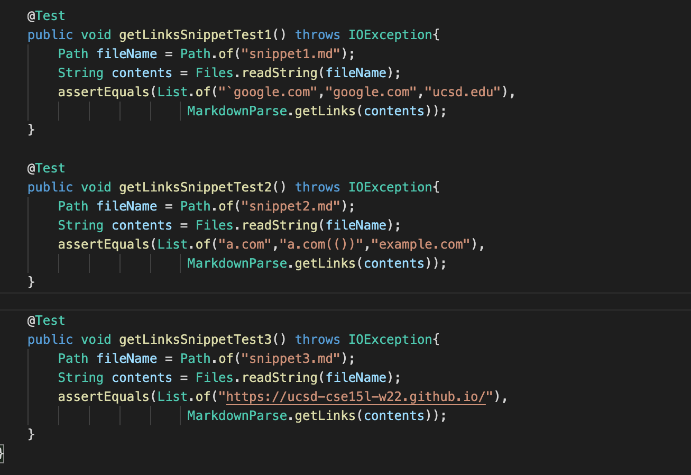
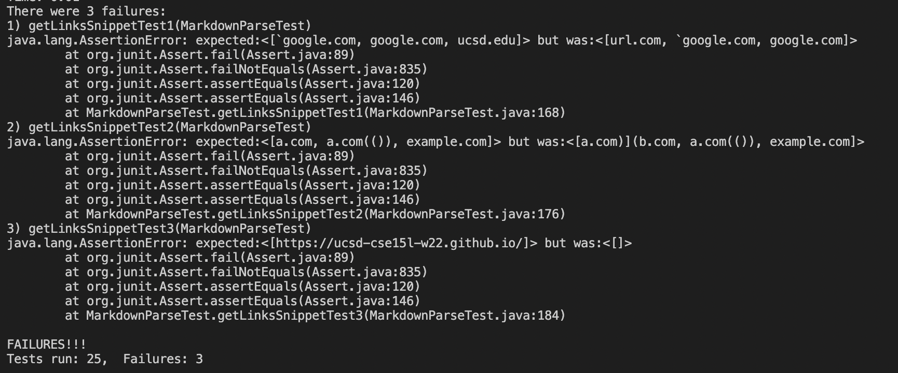
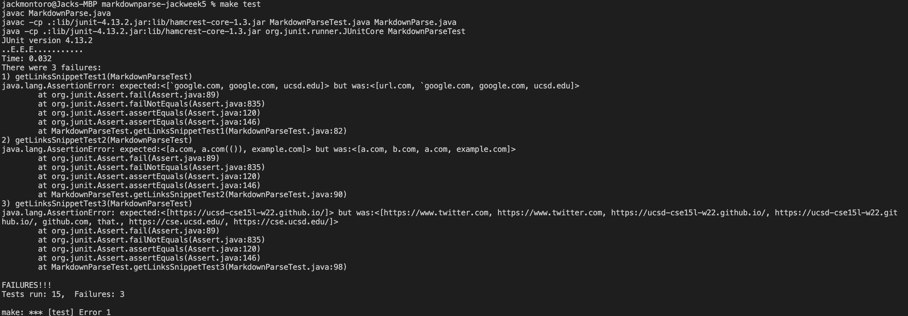

# Lab Report 4

> Repositories
1. [other group](https://github.com/bimai25/markdown-parse-brandon)
2. [our group](https://github.com/jackmontoro/markdownparse-jackweek5)


# Running Snippet Tests

The output of Snippet 1 should be ```[`google.com, google.com, ucsd.edu]```

The output of Snippet 2 should be ```[a.com, a.com(()), example.com]```

The output of Snippet 3 should be ```[https://ucsd-cse15l-w22.github.io/]```

according to [commonmark.js](https://spec.commonmark.org/dingus/).

The tests were implemented in MarkdownParseTest.java as follows:



# Output for the Other Group's Implementation

When the above tests were run on the other group's implementation, the following output was displayed:



Snippet 1 produced ```[url.com, `google.com, google.com]``` instead of the expected ```[`google.com, google.com, ucsd.edu]```.

Snippet 2 produced ```[a.com)](b.com, a.com(()), example.com]``` instead of the expected 
```[a.com, a.com(()), example.com]```

Snippet 3 produced ```[]``` instead of the expected ```[https://ucsd-cse15l-w22.github.io/]```

# Output for Our Group's Implementation

When the above tests were run on our implementation, the following output was displayed:


