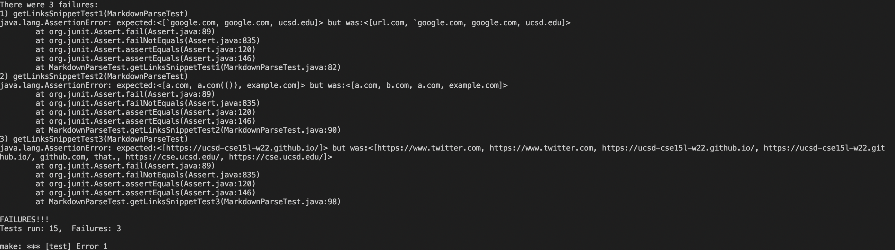

# Lab Report 4

> Repositories
1. [other group]https://github.com/bimai25/markdown-parse-brandon
2. [our group]https://github.com/jackmontoro/markdownparse-jackweek5


# Running Snippet Tests

The output of Snippet 1 should be ```[`google.com, google.com, ucsd.edu]```

The output of Snippet 2 should be ```[a.com, a.com(()), example.com]```

The output of Snippet 3 should be ```[https://ucsd-cse15l-w22.github.io/]```

according to [commonmark.js](https://spec.commonmark.org/dingus/).

The tests were implemented in MarkdownParseTest.java as follows:


# Output for the Other Group's Implementation

When the above tests were run on the other group's implementation, the following output was displayed:


# Output for Our Group's Implementation

When the above tests were run on our implementation, the following output was displayed:


