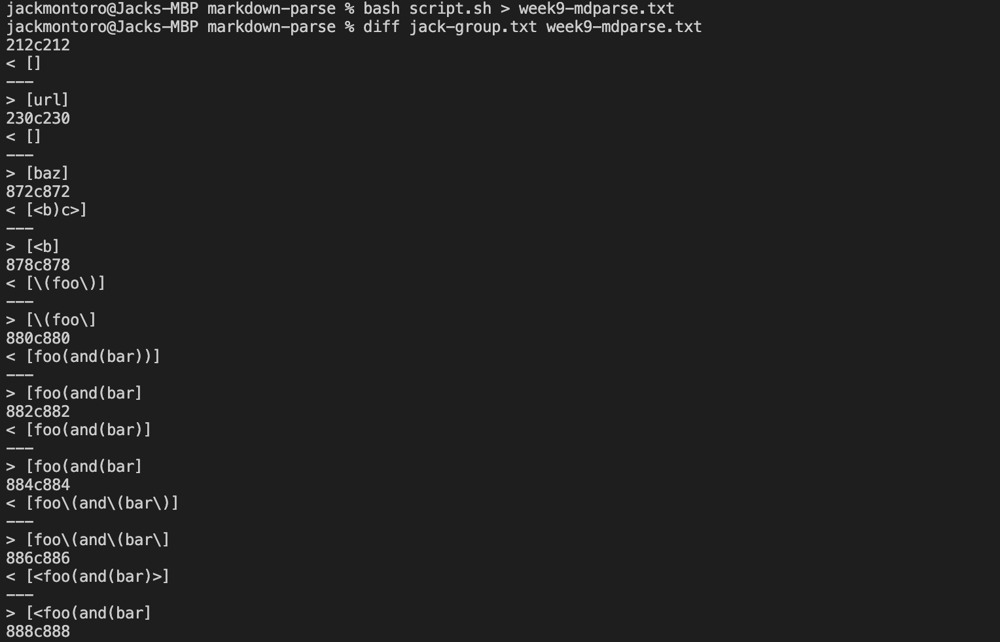

## Lab Report 5

To ascertain the differences between my group's markdown-parse implementation and the week 9 cs15l implementation, I created two txt files from the results of the ```bash script.sh``` command on the two implementations.
The difference between our two implementations was output as follows:



# Test Difference 1:

Our implementation and the instructor implementation differ in the output produced for test-file 194. As we can observe from the picture above, our implementation has no output whereas the instructor implementation outputs ```> [url]```. 

commonmark.js thinks that neither implementation produces the correct output as it should be, ```my_(url)```.

The problem with the instructor's implementation is that it exclusively seeks string between parentheses. This bug is produced by the following code snippet:


The problem with our implementation is that it identifies links in the getLinks method through the presence of the ```"]("``` characters consecutively. This is one way to identify links, but a markdownparse should be able to recognize links in other ways. In the testfile, the parentheses are not adjacent to the brackets, so we never identify a link. We can see the bug in our implementation in the following code:


